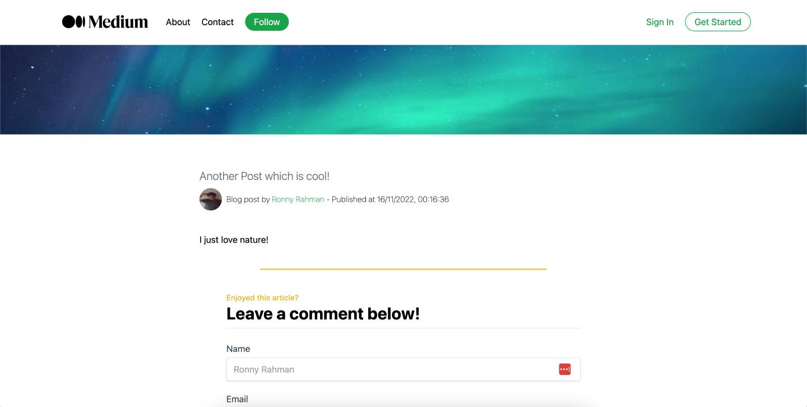

# Medium Blog Clone

Built using Next.JS (React.JS Framework), TypeScript and Tailwind CSS. Content data is pulled from Sanity CMS. This project was referencing a tutorial on YouTube by 'Sonny Sangha'.

[Production URL](https://medium-2-nextjs-clone.netlify.app/)

Global Updates

- React Router to add content on pages mentioned in navigation
- _'Get Started'_ and _'Sign In'_ should display in modal and allows users to access there own account
- Sticky navigation when scrolling past the hero image
- Search functionality

Updates to make on Homepage:

- List of popular categories

Updates to make on Individual posts:

- Seperate navigation and UI
- Read time on posts
- Share posts
- Similar posts section
- Authors page

## Medium Homepage Screen - Before making updates to cloned project


## Medium Blogpost Screen - Before making updates to cloned project



## Getting Started with Create React App and Redux

## Next.js + Tailwind CSS Example

This example shows how to use [Tailwind CSS](https://tailwindcss.com/) [(v3.2)](https://tailwindcss.com/blog/tailwindcss-v3-2) with Next.js. It follows the steps outlined in the official [Tailwind docs](https://tailwindcss.com/docs/guides/nextjs).

## Deploy your own

Deploy the example using [Vercel](https://vercel.com?utm_source=github&utm_medium=readme&utm_campaign=next-example) or preview live with [StackBlitz](https://stackblitz.com/github/vercel/next.js/tree/canary/examples/with-tailwindcss)

[](https://vercel.com/new/git/external?repository-url=https://github.com/vercel/next.js/tree/canary/examples/with-tailwindcss&project-name=with-tailwindcss&repository-name=with-tailwindcss)

## How to use

Execute [`create-next-app`](https://github.com/vercel/next.js/tree/canary/packages/create-next-app) with [npm](https://docs.npmjs.com/cli/init), [Yarn](https://yarnpkg.com/lang/en/docs/cli/create/), or [pnpm](https://pnpm.io) to bootstrap the example:

```bash
npx create-next-app --example with-tailwindcss with-tailwindcss-app
```

```bash
yarn create next-app --example with-tailwindcss with-tailwindcss-app
```

```bash
pnpm create next-app --example with-tailwindcss with-tailwindcss-app
```

Deploy it to the cloud with [Vercel](https://vercel.com/new?utm_source=github&utm_medium=readme&utm_campaign=next-example) ([Documentation](https://nextjs.org/docs/deployment)).

## Sanity Integration

```bash
sanity login
```

I selected Github, but you choose the option you use to login to Sanity

```bash
sanity start
```

It will say _'Content Studio successfully compiled! Go to http://localhost:3333'_

A browser page will open to login to your Sanity account.

To deploy sanity cms to production you need to run:

```bash
sanity deploy
```

## Setup Sanity initialization

Create _'.env.local'_ in the root of the repository

You will need to add the following code:

```bash
NEXT_PUBLIC_SANITY_DATASET={value}
NEXT_PUBLIC_SANITY_PROJECT_ID={value}
SANITY_API_TOKEN={token}
```

Token you get from the API settings for the cms application on Sanity.io

Replace _'{value}'_ with the data you will find in:

```bash
/sanity-medium/sanity.json
```
